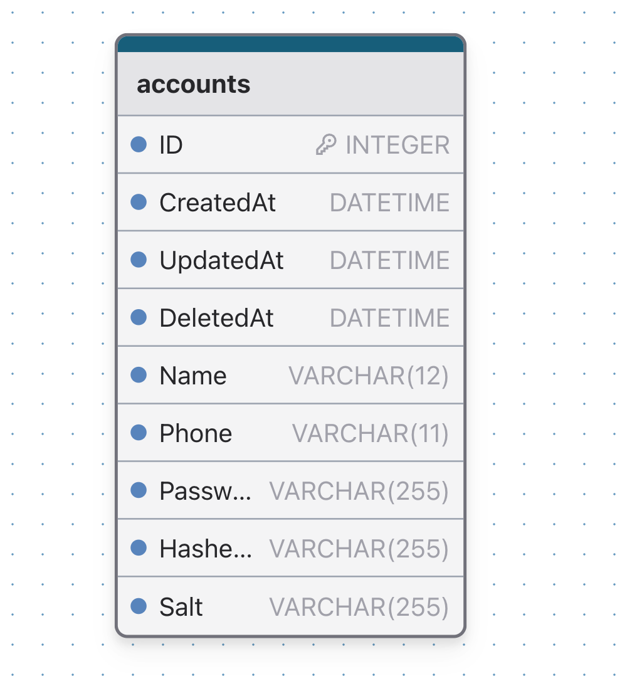

# Account

账户服务

## 资料
- [如何在Go中使用JWT](https://juejin.cn/post/7093035836689612836)
- [使用consul做服务发现](https://www.cnblogs.com/majiang/p/14290357.html)
- [docker-compose启动consul集群](https://www.cnblogs.com/OneSeting/p/17295707.html)

## 目录架构
- AccountServ : 账户微服务
- AccountWeb : 账户web服务
- Conf : 项目配置
- Log : 日志配置
- Share : 全局变量，包括err等
- env : docker启动的环境变量文件
- internal : 配置读取等全局可用的代码

## 数据库表设计


## 服务启动
### 1. 启动docker
```bash
cd Account
docker-compose up -d
```

### 2. 检查nacos, consul, mysql是否正常启动
Nacos : http://127.0.0.1:8848/nacos/index.html
Consul : http://10.7.9.248:8500/ui/dc1


### 3. 启动AccountWeb
```bash
cd Account/AccountWeb
go run main.go
```
服务启动后, 会在Consul上注册一个{Name:account_web, Id:AccountWeb1}的服务, 同时终端会一直收到健康检测的请求

```bash
# 验证服务是否正常启动

curl http://10.7.9.248:8080/health
```

### 4. 启动AccountServ
通过proto生成go文件
```bash
cd Account/AccountServ
protoc --go_out=. --go-grpc_out=. account.proto
```

```bash
cd Account/AccountServ
go run main.go
```
可以在不同的终端启动多个AccountServ服务，每个服务会使用随机的端口号和uuid注册到Consul上
当使用AccountWeb url请求AccountServ时，会使用`internal/load_balance.go`中定义的负载均衡算法，在已经注册的服务中选择一个响应请求

```bash
# 验证web, serv服务是否正常

curl http://10.7.9.248:8080/account/name/rem 
```

### 5. 注册/注销服务
注册服务
- 可以修改internal/consul_test.go中的注册函数来批量添加需要注册的服务, 用作测试

注销服务
```bash
curl --request PUT http://10.7.9.248:8500/v1/agent/service/deregister/${service-id}
```

### 6. 测试JWT token
1. 运行服务
  ```bash
    # shell 1
    cd AccountServ
    go run main.go

    # shell 2
    cd AccountWeb
    go run main.go
  ```
2. 在RapidAPI中使用POST请求 http://10.7.9.248:8080/account/login, 获得返回的JWT token
3. 在RapidAPI中使用GET请求 http://10.7.9.248:8080/account/jwt_test, 请求头的Auth字段天填写刚刚获得的JWT token