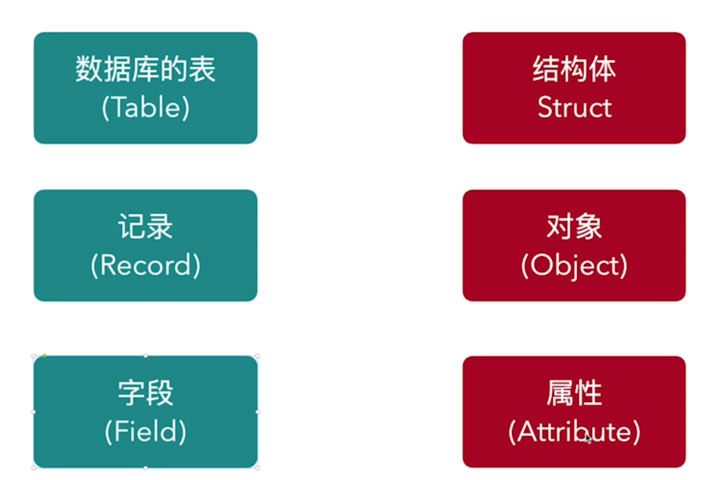

# Ch04-笔记
## 4-1 ORM的前世今生
### What is ORM
ORM = Object Relation Mapping

### Go 与 ORM


### ORM优缺点
优点
- 有现成的工具
- 代码易复用, 代码量少易维护

缺点
- 不轻量
- 不适合复杂的查询
- 抽象掉了数据库层, 无法定制独特的sql

## 4-2 Go如何连接数据库
[Gorm官方文档](https://gorm.io/zh_CN/)

### Docker中运行mysql
1. 安装Docker
   ```bash
        brew install --cask --appdir=/Applications docker
    ```

2. 在Docker中安装mysql
    ```bash
        docker pull mysql/mysql-server
    ```

3. 编辑docker-compose.yml & 启动 mysql
    ```yml
        version : '3.1'

        services:
        db:
            image: mysql/mysql-server 
            command: --default-authentication-plugin=mysql_native_password
            restart: always
            ports:
            - "3306:3306"
            environment:
            MYSQL_ROOT_PASSWORD: 123456
            volumes:
            - ./data:/var/lib/mysql
    ```

    ```bash
        docker-compose up
    ```

4. Go连接sql
   ```go
    package main

    import (
        "gorm.io/driver/mysql"
        "gorm.io/gorm"
    )

    func main() {
        // 参考 https://github.com/go-sql-driver/mysql#dsn-data-source-name 获取详情
        dsn := "root:123456@tcp(127.0.0.1:3306)/dbname?charset=utf8mb4&parseTime=True&loc=Local"
        _, err := gorm.Open(mysql.Open(dsn), &gorm.Config{})
        if err != nil {
            panic(err)
        }
    }
    ```
    > 遇到报错: [error] failed to initialize database, got error Error 1130: Host 'x.x.x.x' is not allowed to connect to this MySQL server

    > 解决方法: [stackoverflow](https://stackoverflow.com/questions/1559955/host-xxx-xx-xxx-xxx-is-not-allowed-to-connect-to-this-mysql-server)

### 进入Docker执行mysql命令
**进入docker**
```bash
docker ps
docker exec -it CONTAINER_NAMES /bin/bash
```

**mysql新建数据库**
```bash
mysql -u root -p
show databases;
```

```sql
CREATE DATABASE test
CHARACTER SET utf8mb4
COLLATE utf8mb4_general_ci;
```