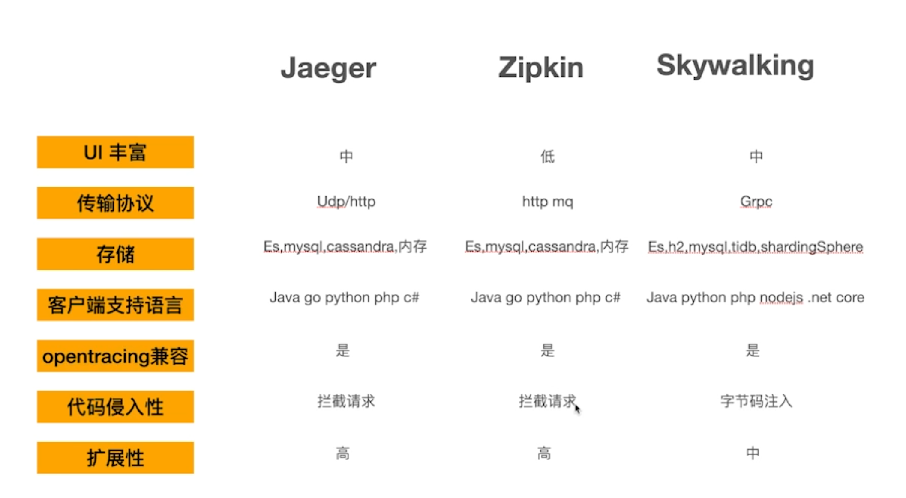

# 视频阅读笔记
## 1. 代码组织架构
可以参考别的微服务系统的组织架构

## 2. 已使用组件
- 日志库: zap(思考如何优雅的把zap集成到项目中)
- 配置读取: viper
- 微服务通信: grpc
- 配置中心: nacos
- 服务发现: consul

## Ch18-链路追踪
1. 为什么需要链路追踪工具?
    方便甩锅

2. 如何选择链路追踪框架?
   

3. 链路协议标准
    `OpenTracing`

4. 安装链路追踪工具
   `docker-compose`

## Ch19-消息队列

## Ch20-限流、熔断和降级
1. 限流技术
    sentinel / Hystrix
2. 熔断技术

## Ch21-分布式事务